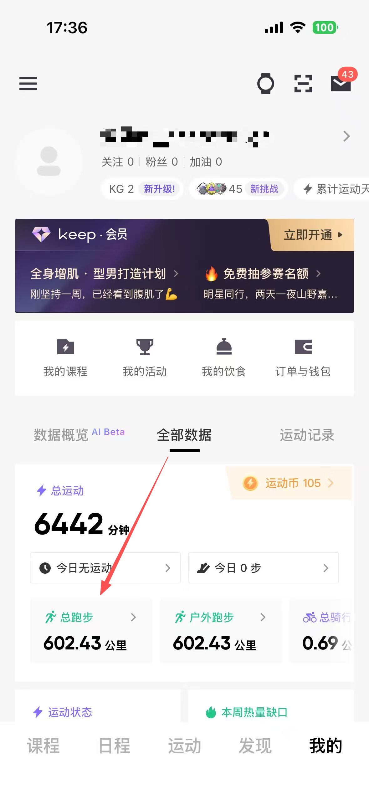
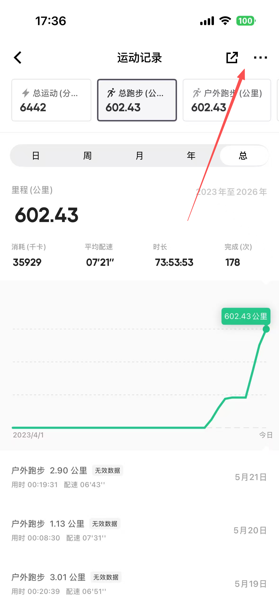
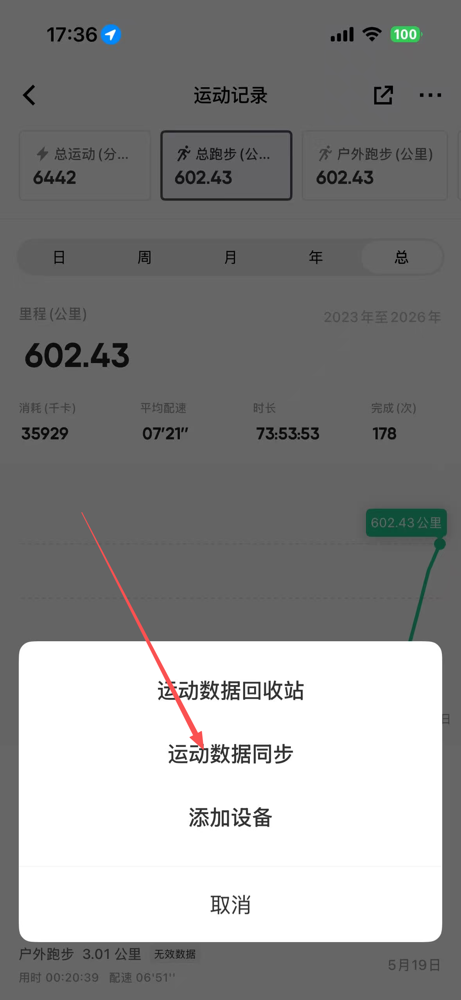
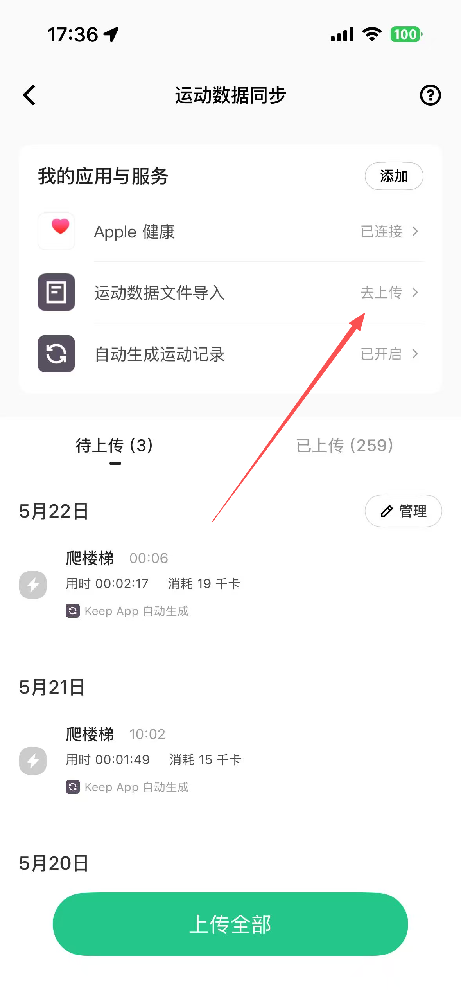

# 数据生成后使用指南

下面这篇指南用于指导如何使用导出过后的压缩包，来完成具体的跑步数据

## 下载压缩包到手机，或者发送到手机

通过各种方法将web页面生成的压缩包发送到手机，或者通过手机在局域网内打开该网页导出压缩包

## keep数据导入教程

参考下列图例，进行数据导入

点击 *我的*

点击 *总跑步*

点击 *上方三个点*

点击 *运动数据同步*

点击 *运动数据文件导入*

